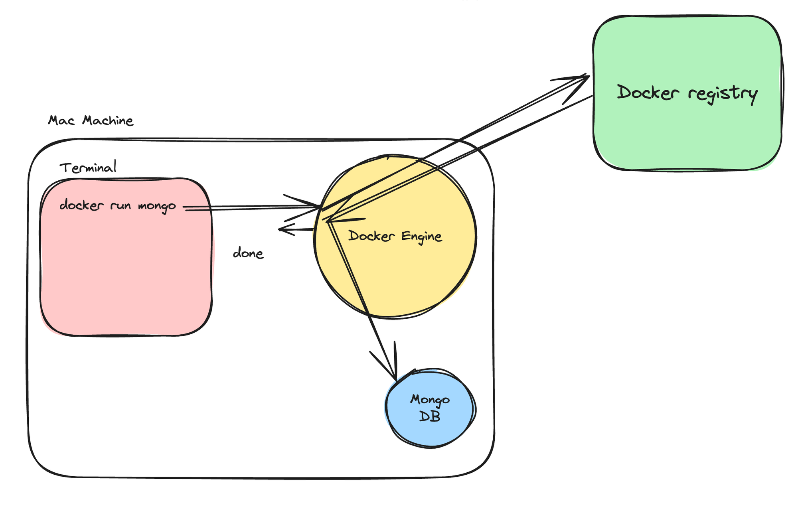
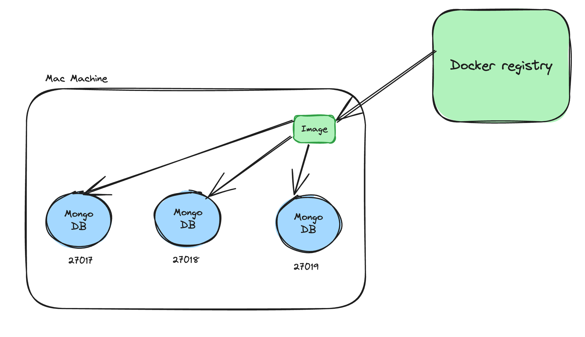
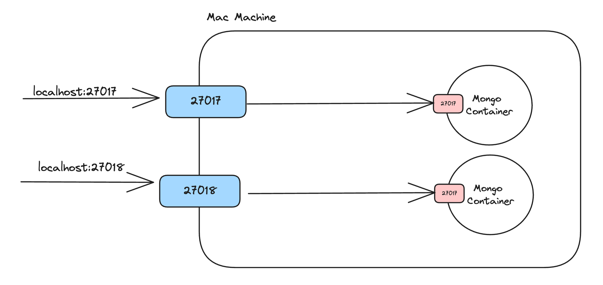

# Week 15 - Docker

## Command to Run MongoDB

To run MongoDB using Docker, execute the following command:

```bash
docker run -d -p 27017:27017 mongo
```

As an application/full stack developer, you need to be comfortable with the following terminologies -


- Docker Engine
- Docker CLI - Command line interface
- Docker registry



## Images vs containers
Docker Image
- A Docker image is a lightweight, standalone, executable package that includes everything needed to run a piece of software, including the code, a runtime, libraries, environment variables, and config files.

 
Docker Container
- A container is a running instance of an image. It encapsulates the application or service and its dependencies, running in an isolated environment.



## Port mapping

```bash
docker run -d -p 27018:27017 mongo
```


## Common docker commands
- docker images
- docker ps
- docker run
- docker build
